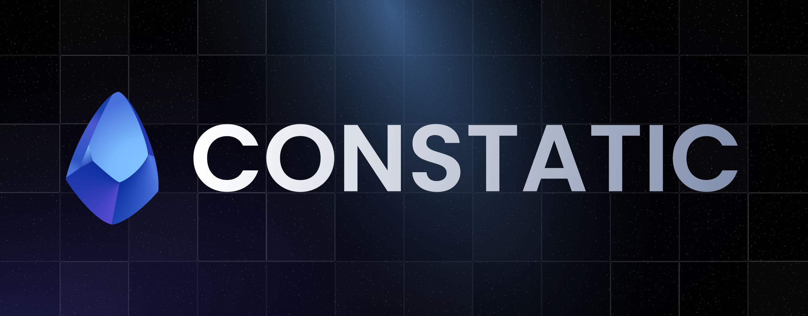

Tools for developing modern Discord bot applications.

[📚 See the documentation](https://constatic-docs.vercel.app)

## Packages
- `@constatic/base` ([source](./packages/base)) - Base with structures and functions for creating modern Discord applications.

## Tools

- `Constatic CLI` ([source](./tools/cli))
- `Constatic vscode theme` ([source](./tools/theme))

---

## Links
- [Documentation](https://constatic-docs.vercel.app) ([source](./apps/docs))
- [Supporter server](http://discord.gg/tTu8dGN)